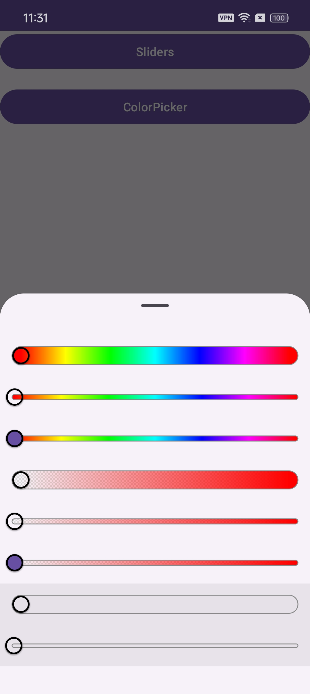
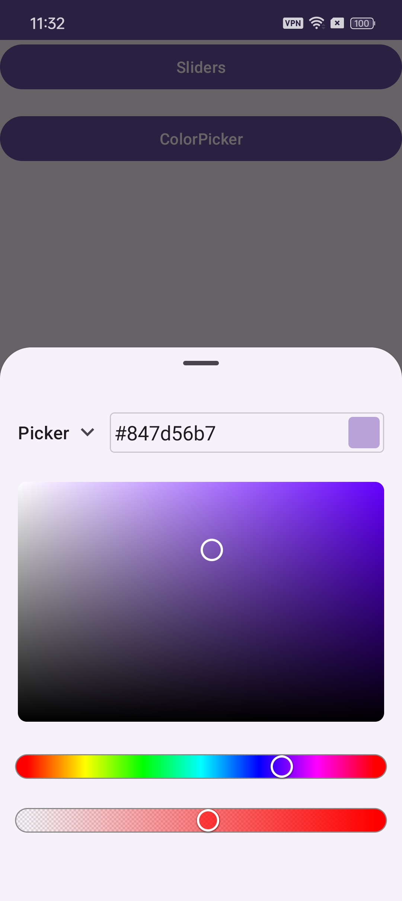

# ColorPicker
color picker for android,material you style 

It mainly includes two parts of content：
* Rewrite the slider and add a grid with background representing transparency
* Color picker

## Demo video
[ColorPicker preview video](https://youtube.com/shorts/3PaH0leRFnE?feature=share)

## Screenshots

## TO DO
Areas to be optimized：
* hole background used overlayout
* running lag

